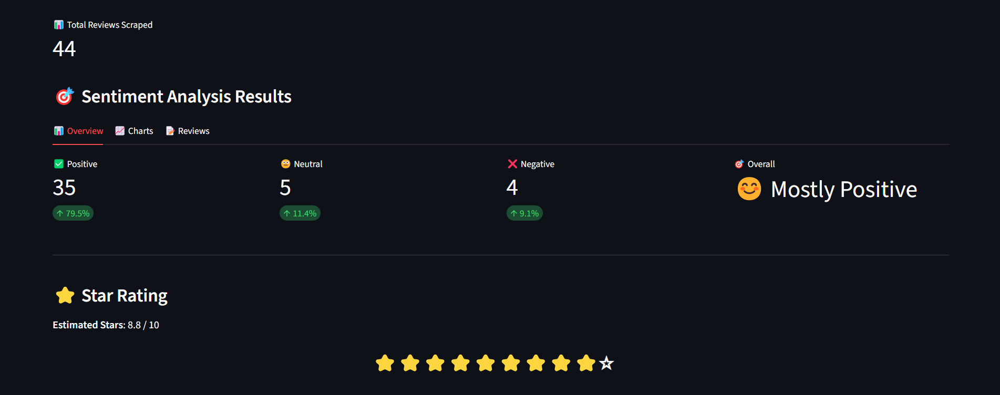

# 🎬 CineSense

A **Streamlit + FastAPI** application for performing **sentiment analysis** on movie reviews. The application scrapes movie reviews from IMDb, processes the reviews using a fine-tuned **RoBERTa** model, and displays sentiment metrics and visualizations.

   
   
   
   


Demo link: [LinkedIn Post](https://www.linkedin.com/posts/het-bhalani-20403b2a8_machinelearning-deeplearning-nlp-ugcPost-7373398573612199936-EILj?utm_source=social_share_send&utm_medium=member_desktop_web&rcm=ACoAAEoLPmQB6j7m8NTTJNu1n7wQBGwWh0xzdtk)

## 🌟 Features

- 🧠 **Fine-tuned RoBERTa** model for sentiment analysis
- 🎥 **Scrape movie reviews** from IMDb
- 📊 **Sentiment Metrics**: Positive, Neutral, Negative
- 📈 **Interactive visualizations** with Plotly (Pie, Bar, Horizontal Bar charts)
- 🔄 **FastAPI** backend for fast and scalable model inference
- 🚀 Deployed on **Hugging Face Spaces** for real-time use

## 🛠️ Technologies Used

- 🐍 **Python 3.8+**
- 🚀 **Hugging Face** (for fine-tuning and model hosting)
- 🤗 **Transformers** (for using RoBERTa)
- 🔧 **FastAPI** (for backend deployment)
- 🖥️ **Streamlit** (for frontend interface)
- 🔬 **Selenium** & **BeautifulSoup** (for web scraping)

## 🖥️ Screenshot




## 🧮 How It Works

1. **Scraping IMDb Reviews** 📊  
   Scrapes the latest reviews of a movie from IMDb using **Selenium** and **BeautifulSoup**.

2. **Sentiment Analysis** 🤖  
   Sends the scraped reviews to the **FastAPI** backend, where they are processed using a fine-tuned **RoBERTa** model.

3. **Stars Rating** ⭐  
   Calculates a stars rating based on the sentiment of the reviews:  
   - Positive = 10 stars  
   - Neutral = 5 stars  
   - Negative = 3 stars

4. **Streamlit Interface** 🖥️  
   Displays the sentiment distribution, stars rating, movie poster, and detailed reviews.


## 🚀 Quick Start

### Installation

1. **Clone the repository**
```bash
git clone https://github.com/hetbhalani/Cine_Sense
```

2. **Install dependencies**
```bash
pip install -r requirements.txt
```

3. **Run the Streamlit Frontend**
```bash
streamlit run main.py
```

## 🧑‍💻 Contributing

Contributions are welcome!
To contribute:

1. Fork this repo

2. Create a new branch (feature/feature-name)

3. Make your changes

4. Create a Pull Request

## ⭐ Support
If you like this project, give it a ⭐ on GitHub!

## 📬 Let's Connect

I'm always open to discussing projects, ideas, or collaborations. You can reach me here:

- 💼 [LinkedIn](https://www.linkedin.com/in/het-bhalani-20403b2a8/)  
- 🐦 [Twitter/X](https://x.com/het_bhalani)  
- 🦤 [Kaggle](https://www.kaggle.com/hetbhalani9)
- 📧 bhalanihet2006@gmail.com 

<br>
Made with ❤️ by Het Bhalani
